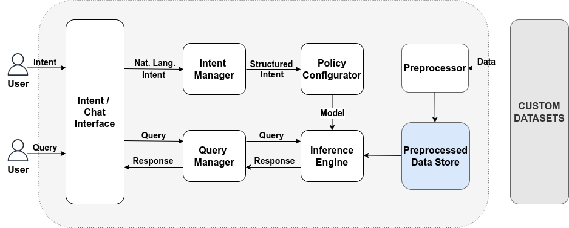

# Intent-based Information Retrieval Software for Data Lifecycle Management

This software is part of the modules of a project on Intent-based Data Lifecyle Management. 
The functionalities of the software include providing users with a chat interface through which they can query custom datasets in specific domains in writing or orally.
It also has an intent-based model selection component that recommends suitable LLMs for processing user queries based on user-defined preferences from models, computing resources analysis, and evaluation of other model properties.
The metrics applied by the component to select these models are: latency, memory usage, accuracy, recall, precision, cross-lingual ability, and verbosity. 
The focus of the research is the analysis and recommendation of the models with these metrics based on user INTENTS.

## Installation

- Download the application code:
    ```
    git clone https://github.com/tissadeking/chat.git
    ```
- Enter the project directory.
    ```
    cd chat

- Install the requirements and run the app:
    ```
    pip install -r requirements.txt
    python3 chat_flask.py
    ```
## Accessing the chat interface
- The software becomes available at http://127.0.0.1:5002.

## Software Architecture


## Workflows Description
- At first, a user defines through the Intent/Chat Interface the type of model they want their info retrieval to apply. This wish is referred to as intent. An example of an intent is 'I need a model that explains things very well, not minding its latency'. The Intent Manager takes in this natural language intent and translates it with Large Language Model (LLM) into a structured intent in JSON format. This structured intent is fed into the Policy Configurator which makes use of an optimisation algorithm and data got from previously conducted analyses of the performances of four LLMs to select the model that suits the user's intent. The metrics applied in analysing the performances of the models are: latency, memory usage, accuracy, recall, precision, cross-lingual ability, and verbosity. The four LLMs used here are: Llama3-8b-8192, Mixtral-8x7b-32768, Gemma2-9b-it and Llama-3.3-70b-versatile, all hosted on the platform Groq. The selected model is sent to the Inference Engine for further use.
- The user can then query the datasets through the Intent/Chat Interface. The query is received and parsed by the Query Manager and sent to the Inference Engine which uses the recommended model from the Policy Configurator above to process the query and retrieve the answer from the Preprocessed Data Store. The Preprocessed Data Store contains the preprocessed datasets from the Custom Datasets folder. All further queries are processed by the selected model stored in the Inference Engine till the user enters another intent to select another model.
- The user can enter their intents or queries either in writing or orally. They can either write their intents/queries on the Intent/Chat Interface and send, or record their speech through the same interface and once they stop recording the interface transmits their audio recording to the software for processing. 
